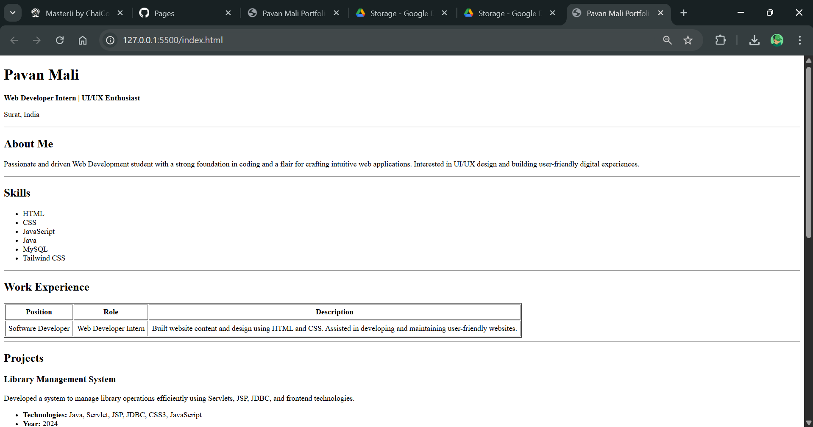
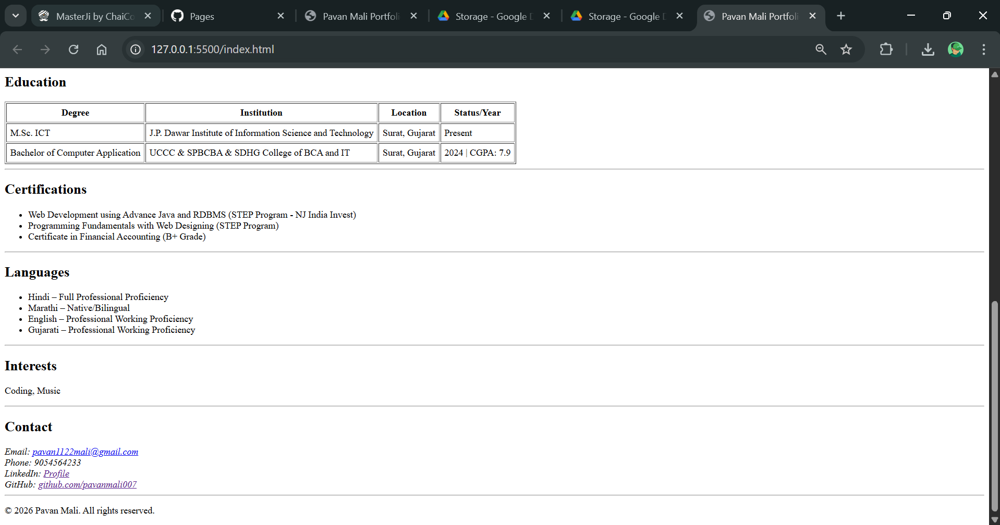

# HTML_Resume_Page_Assignment
TASK: Build a single-page resume website in HTML that looks like the provided layout. This assignment doesn’t need any usage of CSS. Feel free to add your own data, the image below is just an example representation. It should include sections like header/name, about, skills list, experience table, projects, education table, and contact details.

# Resume Website (HTML Only)

This project is a single-page resume website built using only HTML.  
It was created as part of a Web Development Cohort assignment to demonstrate understanding of HTML structure and semantics.

---

## 🚀 Live Demo
🔗 https://yourusername.github.io/resume-website/

---

## 📌 Features

- Proper HTML5 semantic structure
- Header, About, Skills, Experience, Projects, Education, Contact sections
- Tables for structured data
- Lists for skills and project details
- Clean and readable code

---

## 🛠 Technologies Used

- HTML5 only (No CSS, No JavaScript)

---

## Screenshots





## ⚙ Setup Instructions

1. Clone the repository:
   ```bash
   git clone https://github.com/yourusername/resume-website.git
